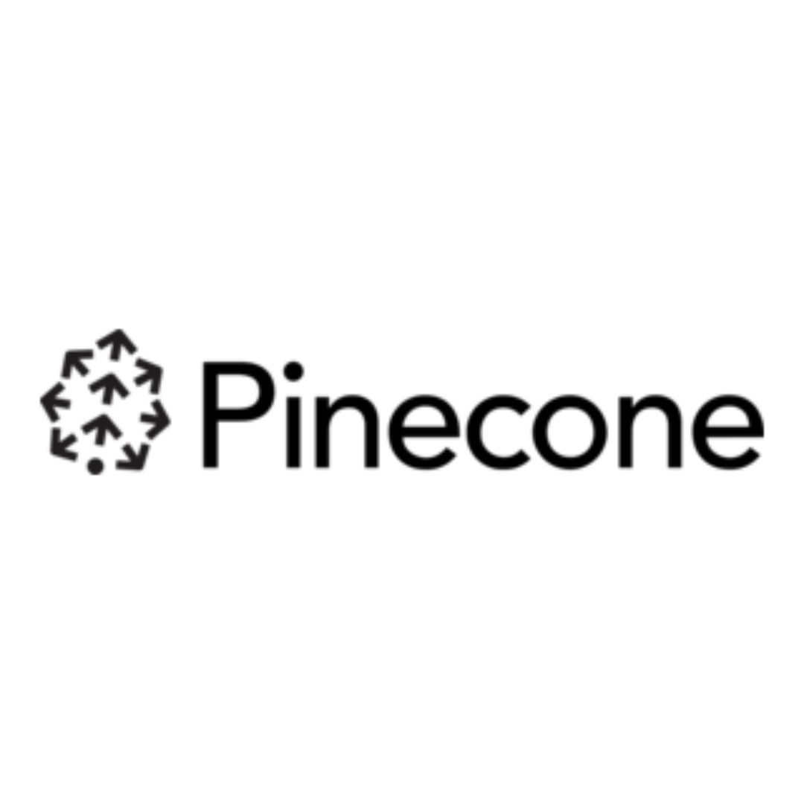
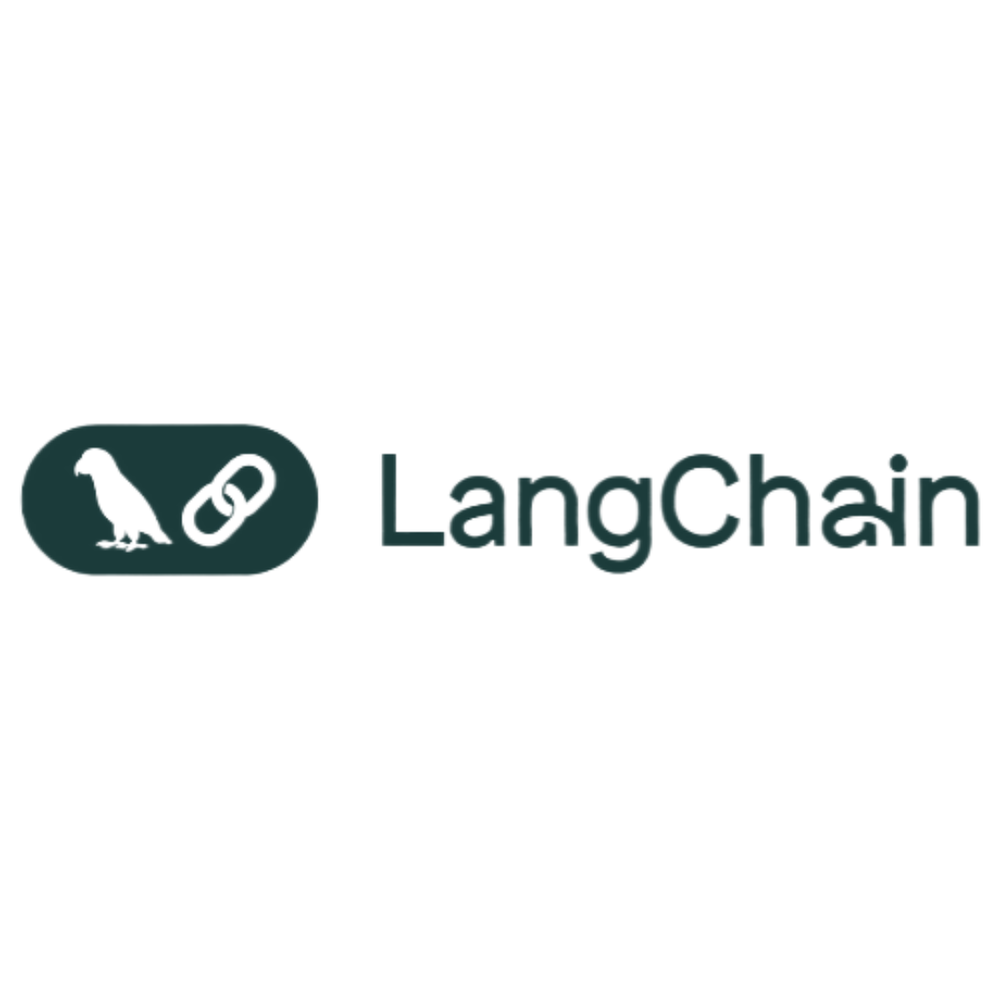
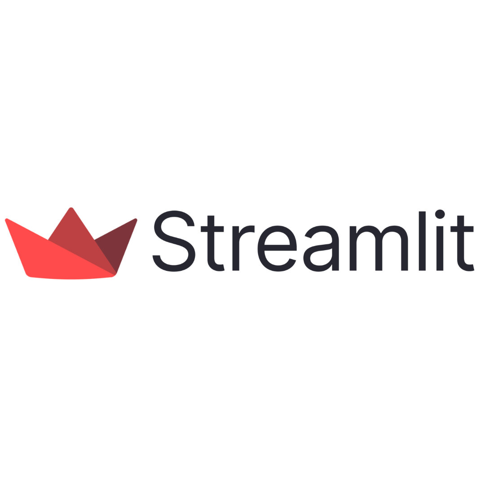

<h1 align="center">I'm Ibrahim Hussain</h1>

  💻 A student passionate about exploring various programming languages  
📫 Reach me at ibrahimbeaconarion@gmail.com  
🔗 Connect with me on [LinkedIn](https://www.linkedin.com/in/ibrahim-hussain-1084ba255)  

---

## 🛠️ Skills

- Programming Languages: Python, C++, JavaScript, HTML, CSS
- Areas of Interest: Data Analysis, NLP, Web Development

---

## 📊 GitHub Stats

  
   
  

---

## 🔧 My Tools

  
  
  
  
  

---

<!-- ## 📈 Contribution Graph -->

<!-- 
 -->
<!--    -->
<!-- 
 -->
<!-- --- -->

