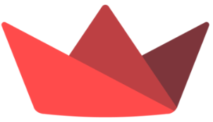

<h1 align="center">I'm Ibrahim Hussain</h1>

  💻 A student passionate about exploring various programming languages  
📫 Reach me at ibrahimbeaconarion@gmail.com  
🔗 Connect with me on [LinkedIn](https://www.linkedin.com/in/ibrahim-hussain-1084ba255)  

---

## 🛠️ Skills

- <strong>Relevant Coursework:</strong> Data Analysis and NLP, Data Structures, Databases, Introduction to Data Science, Software Engineering, Advanced Statistics, Linear Algebra
- <strong>Programming Languages:</strong> Python, C++, JavaScript, HTML, CSS, LaTeX
- <strong>AI:</strong> NLP, Hugging Face, LangChain, Agentic AI.
- <strong>Databases:</strong> PostgreSQL, SQLite, Vector Databases (Pinecone)
- <strong>Operating Systems:</strong> Windows, Linux(Arch, Mint, Ubuntu)
- <strong>Areas of Interest:</strong> Tech Leadership, Data Analysis, NLP, Team Collaboration, Analytics Enthusiast, Web Development, UI/UX Design, Digital Marketing, Graphic Design, Video Editing, Game Development
- <strong>Languages:</strong> English (Fluent), Urdu (Native), Italian (Basic)

---

## 📊 GitHub Stats

  
   
  

---

## 🔧 My Tools

  
  
  
  
  

---

<!-- ## 📈 Contribution Graph -->

<!-- 
 -->
<!--    -->
<!-- 
 -->
<!-- --- -->

